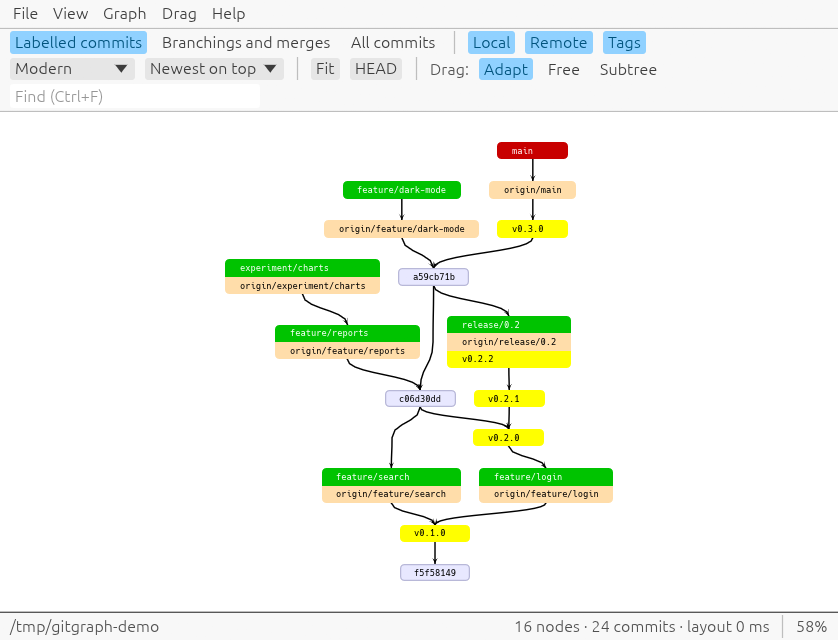

# gitgraph

A standalone, fast, native re-creation of TortoiseGit's **Revision Graph**: a compact,
tree-like picture of how the branches and tags of a git repository relate, in a resizable window
that runs on Linux and Windows (and should run on macOS).

On top of the TortoiseGit look you can rearrange the graph by hand. Drag a node and the rest of
the graph gives way a little: neighbours follow along their edges and nodes in the way move
aside, like weak magnets. Other drag modes move only the selected nodes, or a whole subtree.
Edges at moved nodes are routed afresh through the gaps between nodes, so they lose bends they
no longer need and go around nodes that are now in the way.



_(Made with `scripts/make-demo-repo.sh`: local branches green, remote branches orange, tags
yellow, the current branch red.)_

## Usage

```sh
gitgraph [PATH]                    # open the repository containing PATH (default: .)
gitgraph --mode branches           # also show every fork point and merge
gitgraph --mode all --no-remotes   # every commit, local branches and tags only
gitgraph --look classic            # straight, unbundled edges like TortoiseGit
gitgraph --export graph.svg        # write an SVG without opening a window
gitgraph --help                    # all options
```

In the window:

| Do | To |
|---|---|
| Drag a node | Move it, with the rest of the selection it belongs to. In *Adapt*, the graph gives way and keeps children above their parents. |
| `1` / `2` / `3` | Drag mode *Adapt* (the graph gives way) / *Free* (nothing else moves) / *Subtree* (take along everything that grows out of it) |
| Click, `Ctrl`+click, `Shift`+click a node | Select it / toggle it / add it to the selection |
| `Shift`+drag the background | Select the nodes in a rectangle |
| Hover / click an edge | List the commits collapsed into it / keep it highlighted while you look around |
| `Ctrl+Z` / `Ctrl+Shift+Z` | Undo / redo a move |
| Drag the background, wheel, Shift+wheel | Pan |
| Ctrl+wheel, pinch, `+` `-` `0` | Zoom |
| `F`, double-click the background | Fit the whole graph |
| `Home` / `H` | Go to HEAD |
| `Ctrl+F`, then `Enter` / `F3` | Find branches, tags, hashes, subjects or authors |
| Right-click a node | Copy its hash, ref names or subject; select its subtree; return it to the layout |
| `R` | Return all nodes to the layout |
| `Esc` | Clear the selection |
| `F5` | Reload the repository |

The toolbar and the *Graph*, *View* and *Drag* menus hold the options. TortoiseGit's
options are all there:
- show branchings and merges
- local or remote branches
- tags, and "show all tags"
- arrows pointing towards merges
- zoom, the overview map and export

gitgraph adds:
- four directions and three vertical placements
- edge bundling, row splitting and curved edges
- first-parent-only view, and stash or other refs
- light and dark themes
- rearranging by hand: drag modes, multi-selection, undo

Colours follow TortoiseGit:

| Label | Colour |
|---|---|
| Current branch | red |
| Local branches | green |
| Remote branches | light orange |
| Tags | yellow |
| Commits without refs | pale lavender, showing an 8-digit hash |

gitgraph needs `git` on `PATH` at runtime; it reads the repository with `git log` and
`git for-each-ref` and never writes to it.

## Building

Requires a stable Rust toolchain (install with [rustup](https://rustup.rs)).

```sh
cargo build --release          # binary: target/release/gitgraph
cargo test --workspace         # unit + integration tests (need git on PATH)
cargo clippy --workspace --all-targets
```

On Linux the window uses Wayland or X11 through `winit`; no extra development packages are
needed to build. See [docs/building.md](docs/building.md) for Windows and macOS notes.

## Layout of the repository

| Path | What |
|---|---|
| `crates/gitgraph-core` | GUI-free core: git loading, revision-graph reduction, layered layout, drag physics |
| `crates/gitgraph` | The `gitgraph` binary: egui/eframe window, rendering, interaction |
| `docs/research/` | Notes on how TortoiseGit's revision graph works, with source links |
| `docs/architecture.md` | How the pieces fit together |
| `TODO.md` | Open questions and planned work |
